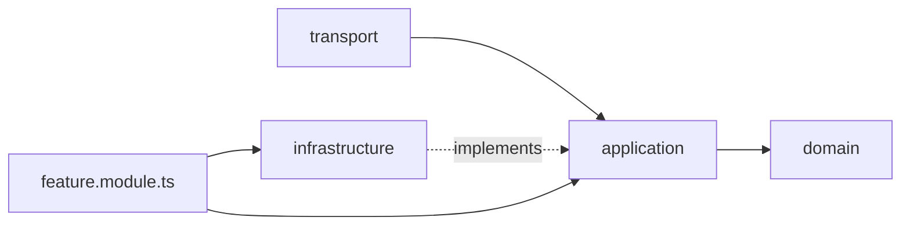

# Repository instructions

Instructions for anyone — human or AI — changing this repository.

## Clean code is mandatory

**Clean code best practices MUST be applied to every change here.** This is not a
preference or a nice-to-have. A change that works but violates these rules is
incomplete and must not be merged.

Every change MUST satisfy all of the following.

### 1. SOLID

- **Single responsibility** — one reason to change per function, class, module.
  If you need "and" to describe it, split it.
- **Open/closed** — add behaviour by adding code, not by editing working code.
  New greeting storage? Add an adapter; do not add branches to the service.
- **Liskov substitution** — an implementation must honour the full contract of
  its port, including the error cases.
- **Interface segregation** — ports declare only what a caller needs, never a
  fat interface that forces irrelevant work on implementers.
- **Dependency inversion** — depend on abstractions. Ports live next to their
  use cases in `application/`; adapters live in `infrastructure/`; the module
  file binds them.

### 2. DRY — one authoritative definition per fact

- Every payload crossing HTTP is declared once, in `packages/contracts`.
  The API validates with it, the web app types from it.
- Constants, limits and environment variable names have exactly one home.
- Shared configuration lives in `packages/*-config`, never copied per app.
- If you are about to write something twice, extract it or ask why the second
  copy is needed.

### 3. Readable, boring code

- Names state intent; no abbreviations, no `data`, `info`, `temp`, `handle`.
- Each function does one thing at one level of abstraction.
- No dead code, no commented-out code, no `TODO` without a tracked issue.
- No `any`, no non-null assertions, no `as` casts to silence the compiler. If a
  type is wrong, fix the type.
- Errors are handled or propagated deliberately — never swallowed, never
  replaced with a default that hides a failure.

### 4. Fail loudly at the boundary

Unknown input is parsed once, where it enters the system: requests through the
contract schemas, responses in the web API client, environment variables at
boot. Inside the boundary, values are already typed and are not re-validated.

## Where these rules are enforced

| Rule | Mechanism |
| --- | --- |
| Payload shapes declared once | `packages/contracts`, consumed by `apps/api` and `apps/web` |
| Dependency direction in the API | `no-restricted-imports` layer rules in `packages/eslint-config/nest.js` |
| Domain stays framework-free | the same rules: no `@nestjs/*`, no `zod` in `domain/` |
| Small, single-purpose units | `complexity`, `max-depth`, `max-lines*`, `max-params` in the shared ESLint configs |
| One way to write a construct | `curly`, `eqeqeq`, `no-else-return`, `prefer-const`, `no-param-reassign` |
| Task order and caching | `turbo.json` — `build` runs after its dependencies'; `dev`, `check-types` and `test` build dependencies first, because `@repo/contracts` is consumed as compiled output |
| Contracts actually match | `apps/api/test/api.e2e-spec.ts` parses live responses with the contract schemas |

Configuration packages are the single source of truth: extend them, do not
create a second convention beside them.

### Toolchain exceptions (deliberate, keep them contained)

- **Shared tsconfig presets MUST NOT declare relative paths** (`outDir`,
  `rootDir`, `paths`, `baseUrl`). TypeScript resolves those against the file
  that declares them, so a preset-level `outDir: "dist"` writes into the preset
  package, silently, while the task still reports success. Declare them in the
  app's own tsconfig.
- `apps/api` pins TypeScript 6.0.3 because the Nest CLI needs the programmatic
  compiler API that TypeScript 7 removed. Every other workspace uses 7.0.2.
  When a Nest CLI release supports 7.x, unpin it.
- Linting is parser-only (no `@typescript-eslint`) for the same reason: no
  release supports the pinned TypeScript. `tsc` and the compiler options
  `noUnusedLocals`/`noUnusedParameters` cover what type-aware rules would.
- Jest transforms through `@swc/jest` rather than `ts-jest` (whose peer range
  excludes TypeScript 7). Type checking therefore happens once, in
  `check-types`, not again during tests.

## Structure

```
apps/web        Next.js frontend            :3000
apps/docs       Next.js documentation site  :3001
apps/api        NestJS service              :4000
packages/contracts        HTTP payload schemas (Zod) + inferred types
packages/ui               shared React components
packages/eslint-config    the only ESLint configs in the repo
packages/typescript-config the only tsconfigs in the repo
```

API layering, per feature module:



`transport → application → domain`, always. Nothing points back out.

## Working rules

- Read the surrounding code before writing; match it.
- Prefer editing an existing file over adding a new one.
- Add a dependency only with a reason — stdlib or platform first.
- Migrate every caller when you change a contract; delete the old path in the
  same change. No aliases, shims, or "keep both for now".
- Keep `apps/docs` content in step with behaviour you change.
- Commands run from the repository root: `npm run build`, `npm run lint`,
  `npm run check-types`, `npm run test`. Add `-- --filter=<app>` to scope one.

## Definition of done

```sh
npm run lint && npm run check-types && npm run build && npm run test
```

All four pass, the changed behaviour was exercised at runtime, and no shape,
constant or convention exists in two places.

App-specific instructions: [apps/api/README.md](apps/api/README.md),
[apps/web/README.md](apps/web/README.md),
[packages/contracts/README.md](packages/contracts/README.md), and
[CONTRIBUTING.md](CONTRIBUTING.md) for the human workflow.
