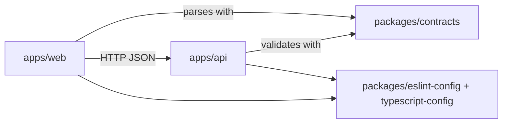

# gen-x-toolkit

A Turborepo monorepo: Next.js frontends, a NestJS service, and one shared
package that owns every shape crossing HTTP.

Built to be read as much as run — **clean code best practices (SOLID, DRY) are
mandatory here**, and where they can be enforced mechanically they are. Start
with [AGENTS.md](AGENTS.md) for the rules and [CONTRIBUTING.md](CONTRIBUTING.md)
for the workflow.

## Structure

| Workspace | What it is | Port |
| --- | --- | --- |
| `apps/web` | Next.js frontend | 3000 |
| `apps/docs` | Next.js documentation site | 3001 |
| `apps/api` | NestJS service | 4000 |
| `packages/contracts` | Zod schemas + inferred types for every HTTP payload | — |
| `packages/ui` | shared React components | — |
| `packages/eslint-config` | the repo's only ESLint configs | — |
| `packages/typescript-config` | the repo's only tsconfig bases | — |

## Quickstart

```sh
npm install            # Node >= 24, npm 11
cp .env.example .env   # optional: every variable has a working default
npm run dev
```

Then open http://localhost:3000 — the page fetches the API's health and greeting
history through `@repo/contracts`, so a green page means the whole chain works.

## Commands

| Command | Effect |
| --- | --- |
| `npm run dev` | all apps in watch mode (builds dependencies first) |
| `npm run build` | build everything in dependency order |
| `npm run lint` | ESLint across the workspace |
| `npm run check-types` | type check every workspace |
| `npm run test` | unit and contract tests |
| `npm run format` | Prettier |
| `npm run build -- --filter=api` | scope a task to one workspace |

## How the pieces fit



- **One contract, two consumers.** `packages/contracts` declares each payload
  once with Zod. The API validates incoming data with it; the web app derives its
  types from it and parses responses with it. Drift becomes a failing test or a
  compile error instead of a bug in production.
- **Layered API.** Inside each feature module the dependency direction is
  `transport → application → domain`, with adapters in `infrastructure`
  implementing ports declared by the application. ESLint fails the build if a
  domain or application file imports Nest, Zod, or an outer layer.
- **Fail loudly at boundaries.** Environment variables are validated at boot,
  requests are parsed at the edge, responses are parsed in the web client.

## Requirements

- Node >= 24 (`engines` in `package.json`)
- npm 11 (`devEngines` in `package.json`)

## License

See the repository owner. Dependencies keep their own licenses.
